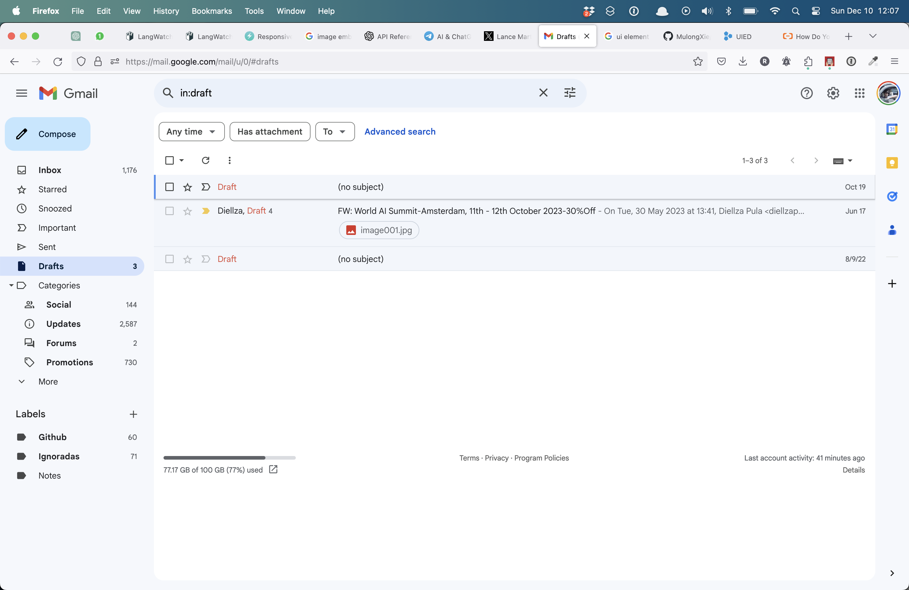
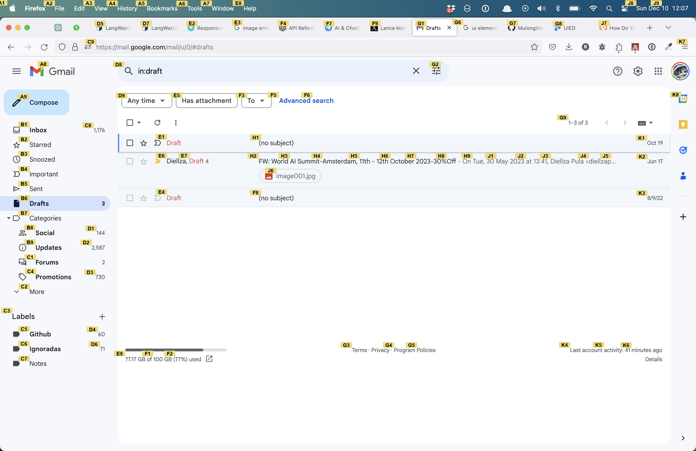

# Driver: GPT-V + OCR Screen Control

This project integrates GPT-V with OCR to address the shortcommings of GPT-V in being able to point to something precisely on the screen. As a result, we have an AI that can fully see, understand and interact with your computer screen.

The way it works is by annotating each identified element with a label that GPT-V can use:

| Screenshot                           | Annotated                                                |
| ------------------------------------ | -------------------------------------------------------- |
|  |  |

## Demo

https://github.com/rogeriochaves/driver/assets/792201/8de94467-393a-487e-b265-46c8b2f4b3b7

[Here is the link to the tweet](https://twitter.com/_rchaves_/status/1734493213199626340)

### More demos

[Playing Tic-Tac-Toe](https://twitter.com/_rchaves_/status/1739596548558725147)

[Navigating in Chinese](https://twitter.com/_rchaves_/status/1741775549930840285)

## Installation

Clone this repo:

```
git clone https://github.com/rogeriochaves/driver.git
```

Install the dependencies:

```
pip install -r requirements.txt
```

Now make a copy of `.env.example` to `.env`, you need to have both OpenAI and Azure Vision OR Google Cloud Vision for the OCR (if you want to contribute, [DM me on twitter](https://twitter.com/_rchaves_) and I can send you a key for Azure Vision)

```shell
# OpenAI key to use GPT-V to be able to "see" the screen
OPENAI_API_KEY=""
# Choose either Azure, Google Cloud Vision or Baidu (better for chinese) to use for OCR to help GPT-V finding elements on the screen
AZURE_VISION_API_KEY=""
AZURE_VISION_ENDPOINT=""
# GCLOUD_VISION_API_KEY=""
# BAIDU_OCR_API_KEY=""
# BAIDU_OCR_SECRET_KEY=""
```

Finally, ask it to do anything you want!

```
python main.py "hey there, please go to my gmail and send an email to Laura with a poem declaring my love"
```

## Acknowledgments

Thanks to @MulongXie et al for building the [UIED algorithm](https://github.com/MulongXie/UIED), which is used together with OCR for identifying GUI elements

## Contributing

There is A LOT that can be done, the project is very very new so
contributions are very welcome! If you have suggestions for improvements or new features, [open an issue](https://github.com/rogeriochaves/driver/issues), and feel free to fork the repository, make your changes, and submit a pull request.

## License

This project is open-source and available under the MIT License. See the LICENSE file for more details.
